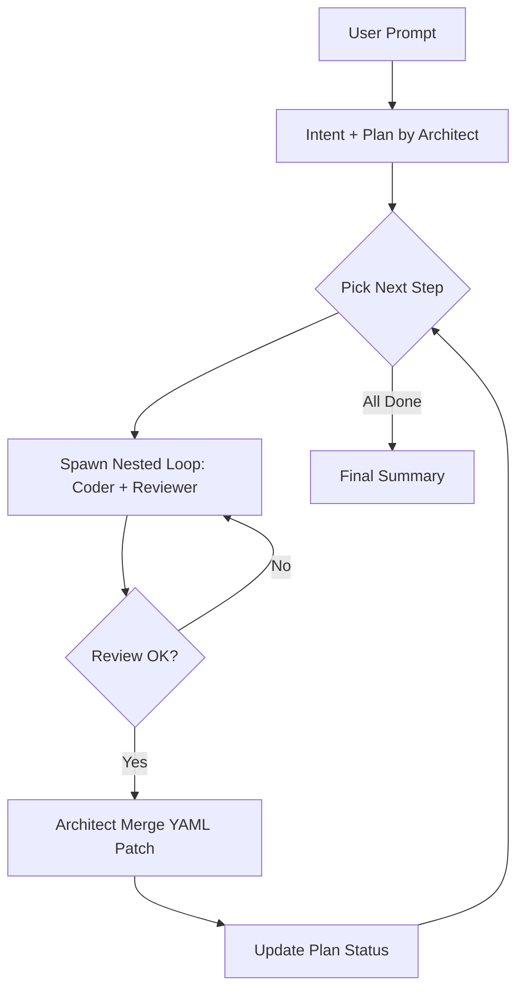
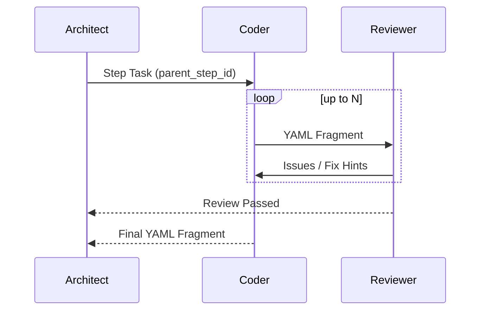

# 多 Agent 混合方案设计（A + C）

> 目标：全局采用 A（Coordinator Loop）维持主 Plan，单步内采用 C（Nested Loop）让 Coder + Reviewer 自纠错输出片段，Architect 只负责合并与推进。

---

## 1. 角色与职责

### 1.1 全局层（A / Coordinator Loop）
- **Architect / Coordinator**：
  - 生成主 Plan（Step1 -> Step2 -> Step3）。
  - 维护全局状态（YAML 主体 + Plan 状态 + 历史记录）。
  - 驱动主循环：逐步选择当前 step 并派发子循环。
  - 决策是否允许改动主 Plan（显式批准）。

### 1.2 局部层（C / Nested Loop）
- **Coder**：根据单步任务生成/修改 YAML 片段。
- **Reviewer**：检查片段（语法、幂等、安全）并给出修复意见。
- **局部 Plan**：
  - 只细化当前 step，不修改主 Plan。
  - 产出以 YAML patch 或步骤片段为主。

---

## 2. 关键约束（强制执行）

1) **主 Plan 由 Architect 生成**，子 Agent 不得改动主 Plan。
2) **子 Plan 只细化当前 step**，不允许增删主 Plan 的结构。
3) 如需修改主 Plan，必须由 **Coordinator 明确批准**。
4) 子 Loop 输出必须归属于 **当前 step**，并附带 `parent_step_id`。
5) 合并动作必须由 Architect 完成（子 loop 不能直接落地）。

---

## 3. 执行流程图

### 3.1 总流程（A + C）



### 3.2 Nested Loop（C）



---

## 4. 事件流与 UI 卡片展示方式

### 4.1 事件流（后端 -> SSE）

**新增/强化事件：**
- `plan_step_start`：某 Step 准备执行。
- `subloop_start`：进入 Coder/Reviewer 子循环。
- `subloop_round`：Coder/Reviewer 的每轮交互。
- `subloop_done`：子循环完成，输出 patch。
- `merge_patch`：Architect 合并片段。
- `plan_step_done`：当前 step 完成。

**事件数据示例：**
```json
{
  "type": "subloop_round",
  "parent_step_id": "step-2",
  "agent_name": "reviewer",
  "status": "running",
  "message": "issues=2"
}
```

### 4.2 UI 卡片建议

| 事件 | UI 表现 | 卡片类型/组件 | 说明 |
|---|---|---|---|
| plan_step_start | Step 卡片出现 | `plan_step` | 展示当前主 Step 标题 |
| subloop_start | 子循环卡片 | `subloop` | 显示 Coder/Reviewer 进入协作 |
| subloop_round | 子循环更新 | `subloop` | 展示轮次与状态 |
| merge_patch | Patch 卡片 | `yaml_patch` | 展示 YAML 片段（diff/内容） |
| plan_step_done | Step 完成 | `plan_step` | 显示完成状态 |

**建议 UI 行为：**
- Timeline 中按 `agent_id/agent_name` 分组。
- 子循环采用 collapsible 卡片展示（默认折叠）。
- Patch 卡片显示“插入/更新 step”的 diff。

---

## 5. 数据结构建议（最小增量）

### 5.1 主 Plan
```json
{
  "step_id": "step-2",
  "step_name": "配置 Nginx",
  "status": "in_progress"
}
```

### 5.2 子 Plan 输出
```json
{
  "parent_step_id": "step-2",
  "yaml_fragment": "- name: render nginx...",
  "review_issues": []
}
```

---

## 6. 合并策略（Architect 执行）

1) 找到 `parent_step_id` 对应 step
2) 只更新该 step 的 YAML 片段
3) 保留主 Plan 结构不变
4) 更新 step 状态：`in_progress` -> `done`

---

## 7. 成功体验（对齐 UI）

用户会看到如下逐步输出：
1. Plan 卡片生成
2. Step 1 卡片（执行中）
3. Coder/Reviewer 子循环卡片（轮次更新）
4. Patch 卡片（Step1 片段）
5. Step1 完成
6. Step2 进入同样流程

这样输出节奏与 Coze 类似：**一步步推进，而不是一次性出完**。

---

## 8. 风险与控制

- 子 loop 反复：设置 `max_rounds`（建议 2-3）
- 子 loop 超时：设置超时时间，超时交由 Architect 判定
- patch 合并失败：回退到原 YAML，并记录历史

---

## 9. 总结

该混合方案实现：
- **全局稳定规划（A）**
- **局部高质量协作（C）**
- **平滑事件流 & Coze 类 UI 体验**

适合 bops 当前架构，并与现有 Plan 机制兼容。
