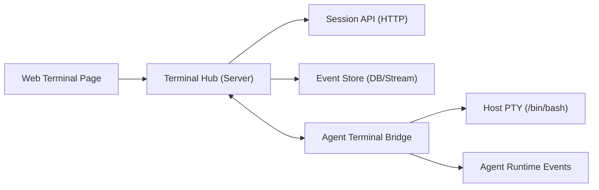
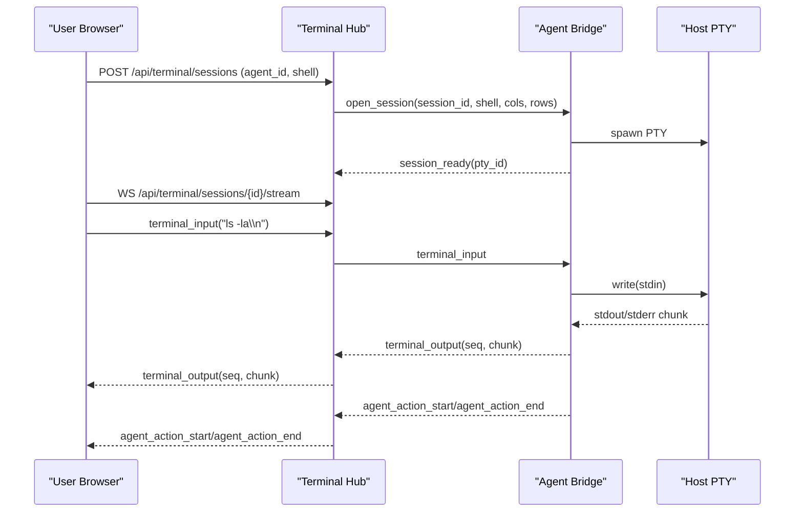

# Terminal 远程实时观测设计方案

## 1. 目标

在 `terminal/` 模块新增“远程终端观测页”，实现以下能力：

- 页面可连接到指定 Agent 主机上的终端会话。
- 实时看到终端输入/输出（双向流式，接近直播效果）。
- 实时看到 Agent 与终端的交互过程（执行了什么命令、何时开始/结束、结果状态）。
- 支持“旁观模式”，像看其他程序员远程操作一样观察全过程。
- 全链路可审计、可追溯、可回放。

## 2. 范围定义

### 2.1 V1 必须完成

- 单会话单主机终端接入（Agent PTY）。
- WebSocket 实时流转发（输入、输出、窗口大小变化）。
- 会话角色：`controller`（可输入）与 `viewer`（只读旁观）。
- Agent 交互事件流：`action_start` / `action_end` / `command_summary`。
- 会话日志持久化（事件级别）与短时回放。

### 2.2 V1 不包含

- 多主机终端合并视图。
- 复杂协同编辑（多控制者并发输入仲裁）。
- 完整录像文件导出（先做事件流回放）。

## 3. 总体架构

建议采用“前端 -> 平台服务 -> Agent”的中转架构，不让浏览器直接暴露到 Agent。



### 3.1 组件职责

- `Web Terminal Page`
  - 渲染终端（建议 `xterm.js`）。
  - 发送键盘输入、窗口 resize。
  - 展示“Agent 交互时间线”。
- `Terminal Hub (Server)`
  - 会话管理、鉴权、角色控制。
  - 双向流转发与广播（controller + viewers）。
  - 事件持久化、回放与断线续传。
- `Agent Terminal Bridge`
  - 在 Agent 主机创建 PTY。
  - 将 PTY 输出转事件流上报。
  - 接收输入事件写回 PTY。
  - 采集 Agent 执行事件并并流。

## 4. 关键流程



## 5. 会话与事件模型

### 5.1 会话对象（Session）

```json
{
  "session_id": "ts_20260206_xxx",
  "agent_id": "agent-prod-01",
  "pty_id": "pty_abc",
  "status": "running",
  "owner": "u123",
  "controller": "u123",
  "viewers": 3,
  "created_at": "2026-02-06T10:00:00Z"
}
```

### 5.2 统一事件包络（Envelope）

```json
{
  "type": "terminal_output",
  "session_id": "ts_20260206_xxx",
  "seq": 1042,
  "ts": "2026-02-06T10:00:12.210Z",
  "source": "pty",
  "payload": {}
}
```

### 5.3 事件类型

- 终端流事件
  - `terminal_input`
  - `terminal_output`
  - `terminal_resize`
- Agent 交互事件
  - `agent_action_start`（开始执行某个动作）
  - `agent_action_log`（动作过程摘要）
  - `agent_action_end`（完成状态、耗时、exit_code）
- 会话控制事件
  - `presence_join` / `presence_leave`
  - `controller_changed`
  - `heartbeat_ping` / `heartbeat_pong`
  - `session_closed`

## 6. 实时协议设计（WebSocket）

### 6.1 前端 -> 服务端

- `auth.init`
  - 携带短期 token 与 `session_id`。
- `terminal.input`
  - `payload`: base64 字节流（避免字符编码问题）。
- `terminal.resize`
  - `payload`: `{ "cols": 140, "rows": 38 }`。
- `session.take_control`
  - 请求抢占控制权（如当前为 viewer）。

### 6.2 服务端 -> 前端

- `session.ready`
  - 会话可用，返回当前 `seq`。
- `terminal.output`
  - 增量输出 chunk。
- `agent.action.*`
  - Agent 与终端交互元信息（可用于右侧时间线）。
- `session.snapshot`
  - 断线重连后下发 `last_n` 事件快照。
- `error`
  - 权限不足、会话失效、Agent 离线等。

## 7. 前端页面设计

## 7.1 页面布局

- 顶栏：会话状态、主机名、延迟、连接质量、控制权状态。
- 左侧主区：终端直播窗口（xterm 渲染）。
- 右侧侧栏：Agent 交互时间线（动作、命令摘要、状态、耗时）。
- 底部状态条：在线观众数、只读/可控标识、快捷键提示。

### 7.2 关键交互

- `viewer` 进入默认只读，点击“申请控制”后切换为 `controller`。
- 终端每次输入在 100-300ms 内回显（内网目标）。
- 右侧时间线实时新增条目，点击可定位对应输出片段。
- 支持“跟随模式”：自动滚动到最新输出；可手动暂停滚动查看历史。

## 8. 后端与 Agent 设计

### 8.1 Server 侧（Terminal Hub）

- `SessionManager`：创建/关闭会话，角色与权限校验。
- `StreamBroker`：WS 广播、顺序号分配、慢消费者隔离。
- `EventWriter`：将事件写入存储（DB/流式存储）。
- `ReplayService`：按 `session_id + seq` 查询并补发历史事件。

### 8.2 Agent 侧（Terminal Bridge）

- `PTYManager`：创建 PTY，读写 stdin/stdout/stderr。
- `EventEmitter`：上报 PTY 输出与 Agent 动作事件。
- `HealthReporter`：周期心跳，带会话负载指标。

## 9. 安全与审计

- 鉴权
  - 用户侧：会话级短期 token（5-15 分钟）。
  - Agent 侧：mTLS 或固定 token + IP 白名单。
- 授权
  - RBAC：`terminal:view`、`terminal:control`、`terminal:audit`。
- 审计
  - 全量记录会话创建、控制权切换、输入事件、Agent 动作事件。
  - 对潜在敏感内容支持脱敏规则（密码、token、私钥片段）。

## 10. 稳定性与性能

- 顺序一致性：每个 session 单调递增 `seq`，前端按 `seq` 重排。
- 断线恢复：客户端带 `last_seq` 重连，服务端补发缺失事件。

---

- 背压控制：慢消费者队列超过阈值时降级为快照 + 增量。
- 容量建议（初始）
  - 单节点 200 并发会话。
  - 单会话 10 viewer 广播。
  - 输出吞吐 1-2 MB/s（突发）可持续。

## 11. API 草案

### 11.1 HTTP

- `POST /api/terminal/sessions`
  - 创建会话（`agent_id`, `shell`, `cols`, `rows`）。
- `GET /api/terminal/sessions/{id}`
  - 查询会话状态与在线成员。
- `POST /api/terminal/sessions/{id}/close`
  - 主动关闭会话。
- `GET /api/terminal/sessions/{id}/events?from_seq=`
  - 拉取历史事件（回放/补偿）。

### 11.2 WebSocket

- `GET /api/terminal/sessions/{id}/stream`
  - 双向实时流入口。

## 12. 数据落库建议

- `terminal_sessions`
  - `session_id`, `agent_id`, `owner`, `controller`, `status`, `created_at`, `closed_at`
- `terminal_events`
  - `id`, `session_id`, `seq`, `type`, `source`, `payload_json`, `ts`
- `terminal_presence`
  - `session_id`, `user_id`, `role`, `joined_at`, `left_at`

## 13. 分阶段落地计划

### Phase 1: 可用最小版（1-2 周）

- 打通 session 创建 + PTY 双向流 + 单 viewer。
- 前端终端窗口可实时输入输出。

### Phase 2: 旁观与 Agent 交互（1-2 周）

- 多 viewer 广播。
- Agent 动作时间线事件接入并展示。
- 控制权切换流程。

### Phase 3: 可靠性与审计（1-2 周）

- 断线续传、事件补发。
- 审计查询与回放接口。
- 敏感信息脱敏与权限细化。

## 14. 验收标准

- 用户可在页面连接 Agent 终端，并实时看到输入输出。
- 可观察 Agent 与终端的实时交互事件，且时间线与终端输出可对应。
- 两个以上旁观者可同时观看同一会话，画面与日志基本一致。
- 断线 30 秒内重连可恢复到最新状态，不丢关键事件。

## 15. 风险与待确认

- Agent 动作事件标准化格式是否统一（不同执行器可能字段不一致）。
- 高吞吐命令输出下的前端渲染性能（需压测）。
- 审计保留周期与存储成本策略（冷热分层）。
- 是否需要“会话录制导出”为后续合规需求预留。
